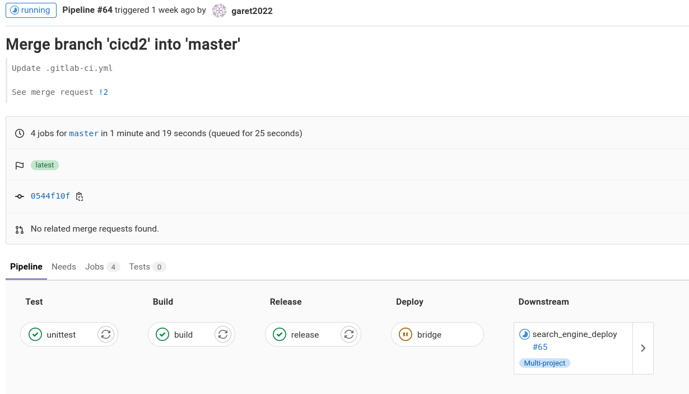
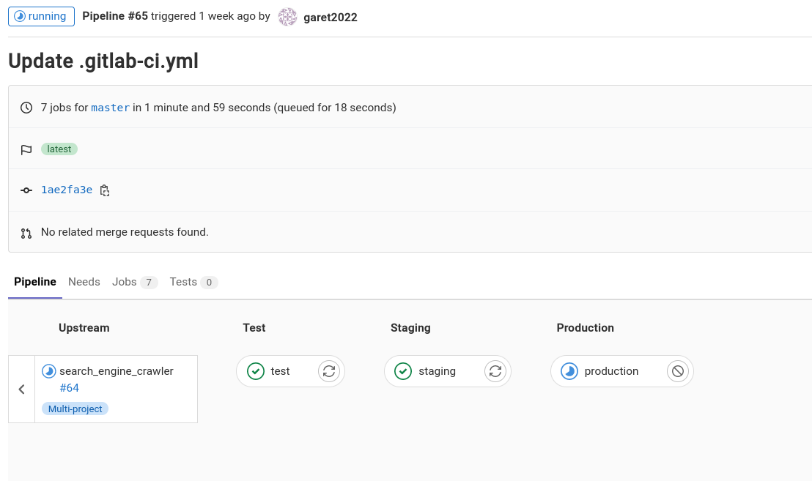
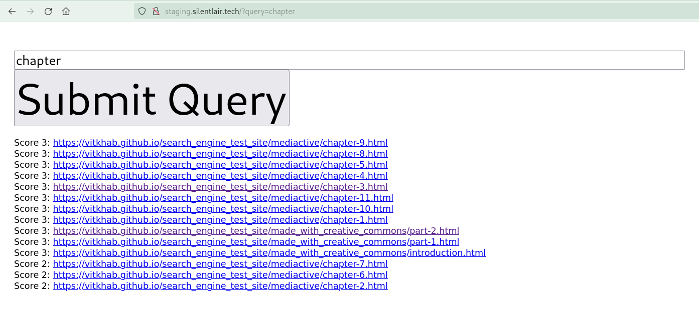
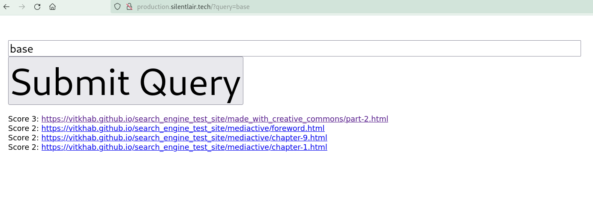
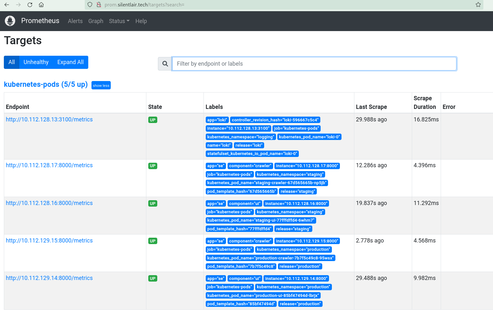
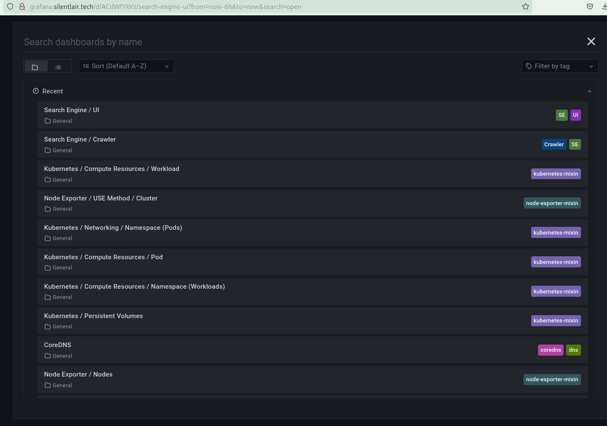
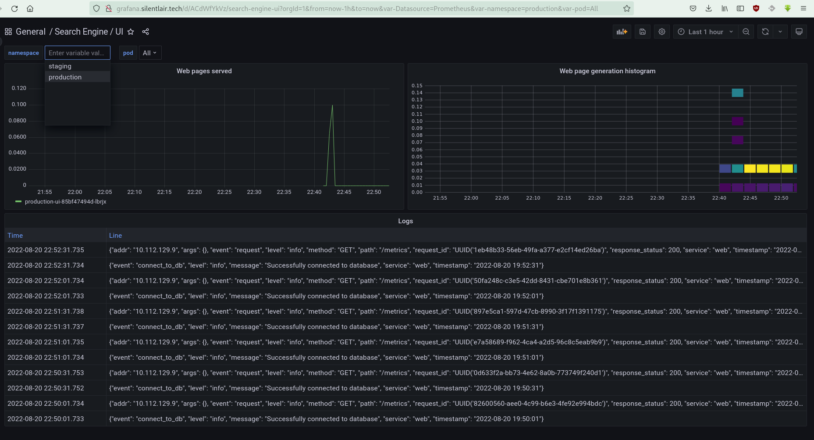
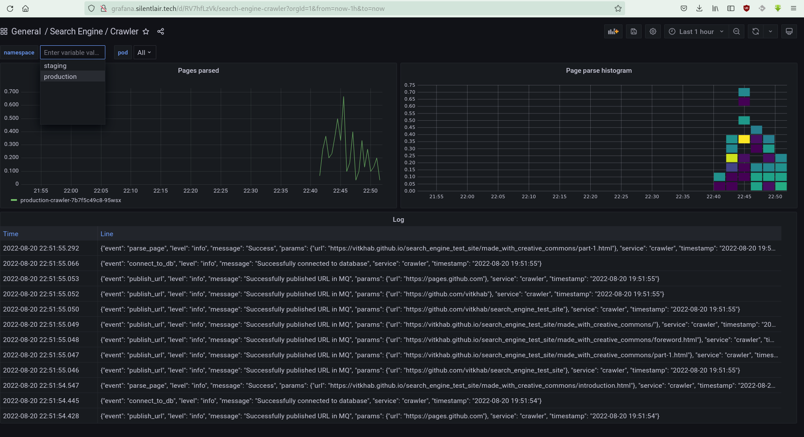

# Курсовая работа по курсу DevOps практики и инструменты.

## Краткое описание

Проект демонстрирует сборку и деплой приложений с использование практик и инструментов DevOps.

## Требования

Репозитории приложений и деплоя в Gitlab (в текущем проекте используется Managed service for GitLab на платформе Yandex Cloud [ссылка](https://garet2023.gitlab.yandexcloud.net/)).

Для предварительной подготовки стенда исполнения проекта требуются инструменты:

- terraform
- yc(yandex console)
- kubectl
- helm

Инструменты можно установить командой:
```
make install_app
```
Terraform разархивируем вручную из zip архива.
Добавляем зеркало terraform registry:
```
cat <<EOF> ~/.terraformrc
provider_installation {
  network_mirror {
    url = "https://terraform-mirror.yandexcloud.net/"
    include = ["registry.terraform.io/*/*"]
  }
  direct {
    exclude = ["registry.terraform.io/*/*"]
  }
}
EOF
```
Требуемые репозитории Helm:
```
helm repo add ingress-nginx https://kubernetes.github.io/ingress-nginx
helm repo add gitlab https://charts.gitlab.io
helm repo add prometheus-community https://prometheus-community.github.io/helm-charts
helm repo add grafana https://grafana.github.io/helm-charts
helm repo update
```
### Создание файлов с переменными

По шаблону файла `terraform/terraform.tfvars.example` создаем файл `terraform/terraform.tfvars` со своими переменными, ключ Yandex Cloud получить командой:
```
yc iam key create --service-account-name admin --output ../key.json
```
По шаблону файла `./config.env.example` создать файл `./config.env` c
    RUNNER_URL   - url gitlab
    RUNNER_TOKEN - токен для раннера
    SLACK_URL    - Webhook slack канала для алертов

### Установка инфраструктуры

Инфраструктура устанавливается коммандами:
```
make install_yc_mk8s
make install_infra_all
make install_runner
```
Будет установлен Managed Service for Kubernetes в Yandex Cloud, конфигурация для kubectl добавится автоматически.
В оркестратор будет установлено:
- Nginx Ingress
- Prometheus 
- AlertManager
- Grafana 
- Loki
- Gitlab Runner

Настройка Gitlab
В группу проекта GitLab нужно добавить переменные:
- KUBE_TOKEN    - токен сервиса из файла `./token`
- KUBE_URL      - адрес кластера Kubernetes, узнать можно командой:
```
yc managed-kubernetes cluster get project-k8s --format=json \
  | jq -r .master.endpoints.external_v4_endpoint
``` 
- REGISTRY_TOKEN - токен с правами read_registry
- API_TOKEN      - токен с правами read_repository

## Описание CI/CD
Два приложения `search_engine_ui`, `search_engine_crawler` тестируются и собираются в своих репозиториях, проходят следующие этапы:
- test - юниттесты и покрытие тестами
- build - сборка контейнера и загрузка в GitLab Registry с временным тэгом
- review - запуск тестовой среды
- cleanup - остановка тестовой среды
- release - сборка контейнера и загрузка в GitLab Registry с тегом из файла VERSION
- deploy - запуск пайплайна из репозитория search_engine_deploy


В репозитории search_engine_deploy запускаются и обновляются среды staging и production:
- test - заглушка для dev среды
- staging - запуск и обновление staging среды
- production - запуск и обновление production среды


### Адреса сред:
Rewiew-среда имеет динамический адрес.

Staging http://staging.silentlair.tech

Production http://production.silentlair.tech


## Описание мониторинга и логирования
### Мониторинг
Мониторинг осуществляется стеком Prometheus и AlertManager, установленными в namespace `monitoring`.

Promtheus - http://prom.silentlair.tech


AlertManager - http://alert.silentlair.tech
В деплоймент подов приложений добавлены аннотации для автоматического обнаружения:
```
annotations:
    prometheus.io/scrape: "true"
    prometheus.io/port: "{{ .Values.service.internalPort }}"
    prometheus.io/path: "/metrics"
```
Алертинг настроен в слак-канал https://devops-team-otus.slack.com/archives/C03RN3KF76F

### Логирование
Сбор логов приложений осуществляется приложением Loki, установленным в namespace `logging`.
Логи автоматически снимаются со всех подов.
Визуализация подключена в grafana, через datasource:
```
- name: 'loki'
      orgId: 1
      folder: ''
      disableDeletion: false
      editable: true
      type: 'loki'
      url: http://loki.logging.svc:3100
      options:
        path: /var/lib/grafana/dashboards/loki
```
### Визуализация
Визуализация метрик и логов осуществляется приложением Grafana, установленным в namespace `monitoring`.
Grafana - http://grafana.silentlair.tech
Помимо стандартных дашбордов визуализации мониторинга кластера Kubernetes, добавлены индивидуальные дашборды приложений:




> Note: ДНС на адреса нужно настроить вручную в файле `/etc/hosts`:
> ```
> 51.250.91.115 grafana.silentlair.tech alert.silentlair.tech prom.silentlair.tech staging.silentlair.tech production.silentlair.tech
> ```